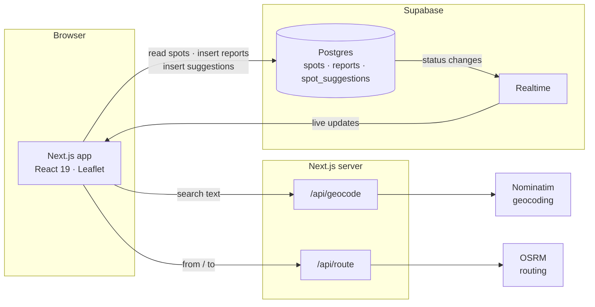

<div align="center">

# Parqo.

**Find parking across Delhi — public lots, private driveways and EV charging — ranked by distance and price.**

[](https://github.com/OWNER/parqo/actions/workflows/ci.yml)


</div>

---

Parqo is a map-first web app for the everyday Delhi problem of not knowing where you will park, what it will cost, or whether there will be space when you arrive. It combines published municipal and metro tariffs with availability reported by drivers standing next to the spot, and adds the things most parking apps ignore: EV connectors, owner-rented private driveways, and the cheaper metro-parking fallback when a destination is full.

## Features

**Find**
- Interactive dark map of parking across Delhi with colour-coded availability pins (open, limited, full, unknown).
- Right-hand spot list with distance from you; click a pin and the list scrolls to its card. The list can be hidden with one button.
- Filters for **public**, **private**, **EV charging**, **open now** and **watching**, plus **nearest** and **cheapest** sorting.

**Plan**
- **Route-aware search** — enter a destination and Parqo draws the driving route and shows only the spots within about 1.2 km of the way, not just around the endpoint.
- **Park & Ride** — when spots around your destination look full, Parqo suggests the nearest Delhi Metro parking, with its tariff and directions. The same fallback appears on any individual spot that is full.
- One-tap directions to any spot in Google Maps.

**Know before you go**
- Real tariff wording per spot (for example NDMC's ₹20/hr up to five hours, then ₹100 flat), not just a single number.
- **EV charging detail** — connector type (Type 2, CCS2, Bharat AC-001) and charging speed in kW.
- **Private spots** carry the owner's weekly hours and a live "available now" indicator.

**Stay in the loop**
- **Watch a spot** and get an in-app toast and a system notification the moment it flips to open.
- "Confirmed by N drivers" appears when several different devices agree on a status within 30 minutes.

**Contribute**
- Drivers report a spot as open, limited or full; reports propagate to everyone in real time.
- **Suggest a spot** with a form and a map pin. Suggestions go into a moderation queue and only reach the map once a maintainer approves them.

## How it works



- The browser talks to Supabase directly with the public anon key. **Row-level security** decides what it may do: read spots and reports, insert reports and suggestions, and nothing else.
- Every report passes a database trigger before it is stored (see [Trust and abuse protection](#trust-and-abuse-protection)). A second trigger then updates the spot's status, and Supabase Realtime pushes the change to every open client.
- Geocoding and routing go through Parqo's own `/api` routes so provider settings, the required Nominatim `User-Agent` and rate limiting stay on the server.

## Tech stack

| Area | Choice |
| --- | --- |
| Framework | Next.js 16 (App Router, Turbopack), React 19, TypeScript |
| Styling | Tailwind CSS v4, `lucide-react` icons |
| Map | Leaflet + react-leaflet, configurable raster tile provider |
| Data | Supabase (Postgres, row-level security, Realtime) |
| Routing / geocoding | OSRM and Nominatim behind server routes |
| Quality | Vitest (unit tests), ESLint, strict TypeScript, GitHub Actions |

## Getting started

**Prerequisites:** Node.js 22 or newer and npm.

```bash
git clone https://github.com/OWNER/parqo.git
cd parqo
npm install
cp .env.local.example .env.local   # optional for local development
npm run dev
```

Open <http://localhost:3000>.

Supabase is optional in development: without the `NEXT_PUBLIC_SUPABASE_*` variables Parqo serves the bundled catalogue and applies reports on your device only. Add them to share reports between users.

### Scripts

| Command | What it does |
| --- | --- |
| `npm run dev` | Start the development server |
| `npm run build` / `npm start` | Production build and server |
| `npm run lint` | ESLint |
| `npm run typecheck` | TypeScript, no emit |
| `npm test` | Run the unit tests once (`npm run test:watch` to watch) |
| `npm run schema:gen` | Regenerate the seed rows in `supabase/schema.sql` from `src/data/spots.ts` |

## Configuration

Copy [`.env.local.example`](.env.local.example) to `.env.local`.

| Variable | Purpose |
| --- | --- |
| `NEXT_PUBLIC_SUPABASE_URL`, `NEXT_PUBLIC_SUPABASE_ANON_KEY` | Enables the shared database and real-time reports. The anon key is public by design and limited by row-level security. |
| `NEXT_PUBLIC_MAP_TILE_URL`, `NEXT_PUBLIC_MAP_TILE_ATTRIBUTION` | Raster tile provider (MapTiler, Stadia Maps, Mapbox, self-hosted). **Set this before launch.** The built-in fallback is for development. |
| `OSRM_BASE_URL`, `NOMINATIM_BASE_URL` | Routing and geocoding backends. Defaults are the public servers, which are for development only. |
| `GEOCODER_CONTACT_EMAIL` | Contact address sent in the Nominatim `User-Agent`, as their usage policy requires. |
| `NEXT_PUBLIC_SITE_URL` | Public origin used for absolute URLs in link previews. |

## Database setup

1. Create a [Supabase](https://supabase.com) project (choose a region close to your users, such as Mumbai).
2. Open **SQL Editor → New query**, paste [`supabase/schema.sql`](supabase/schema.sql) and run it. The script is idempotent and safe to re-run.
3. Put the project URL and anon key from **Project Settings → API** into `.env.local`.

The script creates the tables, row-level-security policies, anti-abuse triggers, the Realtime publication and the initial catalogue of 63 Delhi listings.

### Trust and abuse protection

Status reports drive the whole product, so the database enforces its own rules and does not rely on the client:

| Rule | Behaviour |
| --- | --- |
| Proximity | The reporter's coordinates must be within 1 km of the spot |
| Cooldown | One report per device per spot every 2 minutes |
| Volume | At most 20 reports per device per hour |
| Integrity | The server stamps the timestamp; clients cannot back- or post-date reports |
| Suggestions | At most 5 per device per day, always stored as `pending` |

Rejections carry a `parqo:<reason>` message that the app translates into a plain-language explanation. The device identifier is an anonymous random ID kept in local storage, not an account, so it deters casual abuse rather than determined attackers; move to authenticated users before opening up write access further.

### Moderating suggestions

Suggestions are not publicly readable. Review them in the Supabase dashboard (**Table Editor → `spot_suggestions`**), then publish one from the SQL editor:

```sql
select approve_suggestion('<suggestion id>');
```

The new spot starts unverified with an unknown status. Set `verified = true` on a spot only after checking its location and tariff.

## Data and pricing

The catalogue covers 63 listings across Delhi, chosen to span the city rather than cluster in the centre: public on-street and lot parking, malls, monuments, district centres and private driveways or society slots.

- **Tariffs** follow published categories: NDMC (₹20/hr up to five hours, then ₹100 flat), MCD standard on-street (₹20/hr, ₹100/day cap), MCD premium sites such as Karol Bagh (tiered from ₹40, ₹300/day cap), posted mall tariffs, and DMRC's flat metro-parking structure. Private listings are owner-set. Tariffs change, so confirm against the official rate card before relying on a figure.
- **Availability** comes from driver reports. Listings start with an unknown status and are not marked verified until a maintainer has checked them.
- **Corrections and new spots** are welcome through the in-app suggestion flow.

## Project structure

```
src/
  app/            App Router: page, privacy, error boundary, icons, /api routes
    api/geocode/  Geocoding proxy (validated, rate limited, cached)
    api/route/    Driving-route proxy (validated, rate limited)
  components/     AppShell, TopBar, SpotsPanel, SpotCard, SpotSheet,
                  SuggestSpotSheet, ParqoMap
  hooks/          useSpots, useWatchlist, useRoute, useUserLocation, useDialog
  lib/            Filtering/ranking, geo maths, availability, Supabase repo,
                  validation, messages, map/tile config, server/rateLimit
  data/           Spot catalogue and metro-parking fallbacks
supabase/
  schema.sql      Tables, RLS, triggers, Realtime, seed catalogue
scripts/
  gen-schema.mjs  Regenerates the seed block from src/data/spots.ts
tests/            Vitest suites
```

## Quality

`npm test` runs 41 tests across 8 suites covering ranking and filtering, route-corridor geometry, availability windows, suggestion validation, rate limiting, error mapping, local storage helpers and integrity checks on the spot catalogue (unique IDs, in-area coordinates, consistent EV and private-spot fields). CI runs lint, type-check, tests and a production build on every push and pull request.

Accessibility: dialogs trap focus, close on Escape and restore focus; filters and toggles expose `aria-pressed`; map markers are keyboard reachable and labelled with name and status; motion respects `prefers-reduced-motion`.

## Security and privacy

- Row-level security on every table; suggestions are write-only for the public.
- Security headers (`X-Frame-Options`, `X-Content-Type-Options`, `Referrer-Policy`, `Permissions-Policy`); the `X-Powered-By` header is disabled.
- `/api` routes validate input, bound coordinates to India, cap route length and rate limit per client IP.
- No accounts, advertising or analytics. Location is used in the browser and sent only when a report is submitted. See the in-app [privacy page](src/app/privacy/page.tsx) for details.

## Deployment

Parqo deploys to any Node host; [Vercel](https://vercel.com) needs no extra configuration.

1. Import the repository and add the environment variables above.
2. **Configure a licensed tile provider** (`NEXT_PUBLIC_MAP_TILE_URL`) — the development fallback tiles are not licensed for commercial use.
3. Point `OSRM_BASE_URL` and `NOMINATIM_BASE_URL` at instances or providers you are entitled to use at your expected volume, and set `GEOCODER_CONTACT_EMAIL`.
4. Set `NEXT_PUBLIC_SITE_URL` to your production origin.

The in-memory rate limiter is per server instance. If you run many instances, back it with a shared store such as Redis.

## Roadmap

- Installable PWA with offline shell and true background push notifications for watched spots
- Owner accounts and a host dashboard for managing private listings
- Payments through a licensed provider (Razorpay, Cashfree or similar)
- Reporter reputation built on the report history the schema already keeps
- Content Security Policy and a distributed rate limiter
- Coverage beyond Delhi

## Contributing

Issues and pull requests are welcome. Please run `npm run lint`, `npm run typecheck` and `npm test` before opening a pull request. Changes to `src/data/spots.ts` should be followed by `npm run schema:gen`.

## License

No open-source licence has been chosen yet, so all rights are reserved by the author. A licence will be added before the code is opened to outside contributions.
